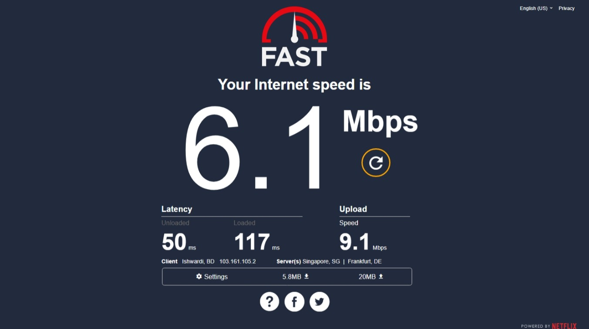
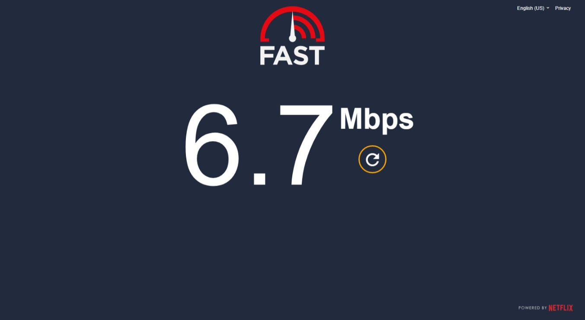

# DraculaFast

A dracula colorcheme inspired **_userstyleCSS_** dark theme for the [fast.com](https://fast.com) internet speedometer website.

## Installation

### Using [Stylus](https://add0n.com/stylus.html)

1. Install [Stylus](https://add0n.com/stylus.html) extension for your browser.
2. Head over to [here](https://userstyles.world/style/8066/dracula-dark-theme-for-fast-com) and click on **Install**
3. Click on **Install Style** button and you are done.

## Screenshots

## Bug Report

If you find any bug or have any suggestion, please open an issue [here](https://github.com/Abir-Tx/DraculaFast/issues/new)

## Contributors

- [Abir-Tx](https://github.com/abir-tx)
